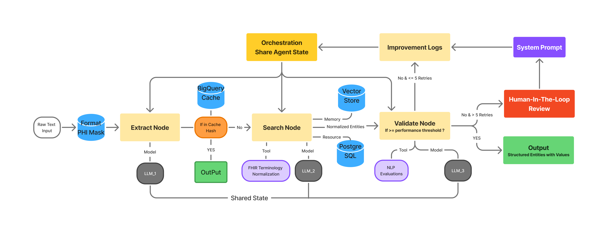

# Clinical Note Extraction Agent

## Overview
This repository contains a **practical clinical note extraction agent system** designed to surface clinically meaningful information that is often missing or underrepresented in structured EHR fields.

Unstructured clinical notes (e.g., discharge summaries) frequently describe **disease progression**, **pre-/post-surgical symptoms**, and **quantitative clinical observations** that are not fully captured in standard EHR records. This project focuses on extracting those signals in a **standards-aware** and **scalable** way.

  

The system is implemented using the **LangGraph** framework and processes unstructured discharge notes from a subset of the **publicly available CLIP dataset**, focusing on patients with **multiple hospital visits**.
---
## Repository Structure
- extractor/ # LangGraph extractor node
- searcher/ # FHIR terminology search logic
- validator/ # NLP-based validation metrics
- api/ # FastAPI wrapper for FHIR server
- docker/ # PostgreSQL + FHIR server setup
## Key Features
- LangGraph-based multi-node agent workflow
- Asynchronous clinical entity extraction for high throughput
- FHIR terminology-driven normalization (SNOMED CT, RxNorm, ICD-9)
- Standards validation using lexical and semantic NLP metrics
- FastAPI abstraction layer for large-scale terminology queries

---

## Input & Output

**Input**
- Unstructured clinical discharge notes (Multiple-Hospital-Visits Patients in CLIP Dataset)

**Output**
- Standardized clinical entities with **associated quantitative values** (e.g., vital signs, measurements)

---

## Setup & Execution

### Prerequisites
- Docker
- PostgreSQL
- Java JDK
- Apache Maven
- Python 3.9+

### High-Level Steps
1. Build and start PostgreSQL using Docker
2. Launch the FHIR terminology server via Maven
3. Load SNOMED CT, RxNorm, and ICD-9 resources
4. Start the FastAPI service
5. Configure Vertex AI and OpenAI credentials
6. Run the LangGraph pipeline

> Note: API credentials and dataset files are not included in this repository.

---

## Credentials Required
- **Vertex AI**: for LLM inference in the extractor node
- **OpenAI API**: for embedding-based semantic similarity in the validator

Environment variables must be set by the user.

---

## Evaluation

The evaluation framework is implemented but results are pending.

Planned metrics include - Mean (Standard Deviation):
- Exact Match Accuracy: 0.89 (0.10)
- Fuzzy Match Score (Token Set Ratio): 0.94 (0.03)
- Semantic Similarity Threshold: 0.91 (0.10)

## License

This repository contains code intended for **research and educational purposes**.

Use of this project may require separate authorization or credentialed access to the following resources:

- **UMLS Metathesaurus**  
  Use of UMLS resources is subject to the UMLS License Agreement and requires a valid UMLS license from the U.S. National Library of Medicine.

- **PhysioNet / CLIP Dataset**  
  The CLIP dataset is distributed via PhysioNet and is subject to PhysioNet’s data use agreements and credentialed access requirements.

This repository **does not redistribute** UMLS, PhysioNet, or CLIP data. Users are responsible for ensuring compliance with all applicable licenses and data use agreements.

